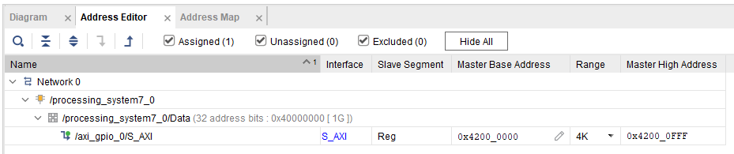

# Stopwatch

This is the FPGA project from the tutorial:
<https://redpitaya-knowledge-base.readthedocs.io/en/latest/learn_fpga/4_lessons/StopWatch.html>

I'm using Vivado 2022.2.

## Introduction to TCL

To create the project, open Vivado and in the console execute the following commands:

```tcl
cd RedPitaya-FPGA-Release_2023.2/prj/Examples   # Change working directory

# Modify make_project.tcl to build the stopwatch project
source make_project.tcl                         # Execute script, 
```

## Accessing Registers from Linux

The is one addressable block in this FPGA design. It is the GPIO block and a 4kB block of registers has been assigned
to it at address 0x4200_0000. This is shown in the address editor:



I beleive for memory-mapped IO registers in the FPGA, you need to find an unused portion of the address space and 
address of you registers there. Given the Red Pitaya board only has 512MB of memory, and address above 0x2000_0000
should be suitable. Then we can just use `/dev/mem` to read and write from these registers.

## Loading the Bitstream

I have flashed the the image `RedPitaya_OS_2.00-15_stable.img` onto the SD card and connect the Red Pitaya to my 
home router. It should use DHCP to get an address. Red Pitaya boards have unique domain names of the form 
`rp-xxxxxx.local`` which is printed on the ethernet port on your board. Try and ping the domain name to check if its
connected. Then you can use ssh to login to the root user as document here: 
<https://redpitaya.readthedocs.io/en/latest/developerGuide/software/console/ssh/ssh.html>

`ssh-copy-id` doesn't exist on windows so you can just copy your public key into the `.ssh/authorized_keys` file.
Just create the file if it doesn't exist.

`scp` the bitstream


